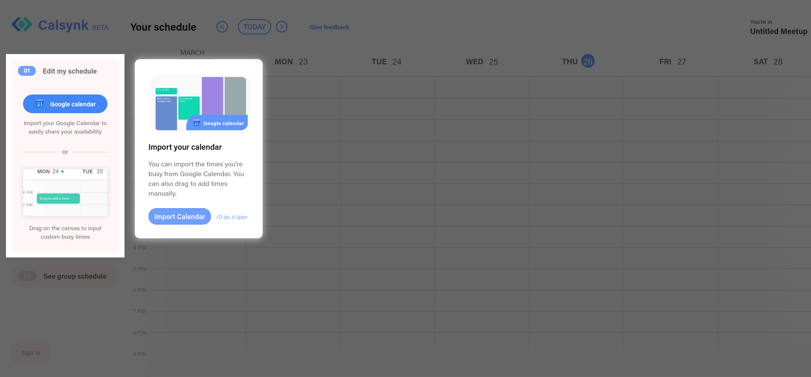

# react-see-through

## Table of Contents
* [Draw attention to the important parts of your website](#draw-attention-to-the-important-parts-of-your-website)
  + [Example](#example)
* [Installation](#installation)
* [Importing](#importing)
* [Use Cases](#use-cases)
* [Documentation/Examples](#resources)
* [Future Plans](#future-plans)

## Draw attention to the important parts of your website
### Example

**\* react-see-through is used here to create the black mask above everything except the tutorial [(source)](https://calsynk.com)**

## Installation
`npm install --save react-see-through`

or

`yarn add react-see-through`

## Importing
To use the react-see-through component, you want to do:

`import { SeeThrough } from 'react-see-through';`

after installing.

## Use Cases
* Slack, Discord, and many other popular services use this type of effect for tutorials
  * This lets them direct users' attention to particular elements being introduced.

## Resources
### [Documentation/Examples](https://andrew4699.github.io/react-see-through/)
### [GitHub](https://github.com/andrew4699/react-see-through)

## Future Plans
* See-through multiple elements at once
* Add an easy way to place things above the mask
* Allow interacting (click, hover, etc...) with the unmasked area
  * Make only certain areas interactable?
* Fade-out animation
* Option to add padding
* Support lone text-nodes
* Better documentation styling
