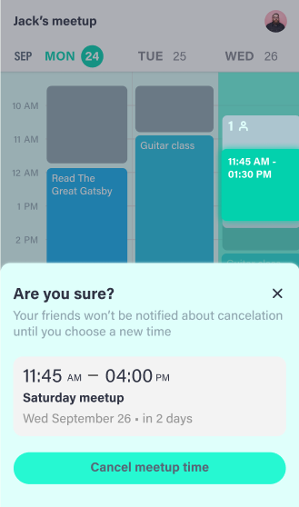

import { useState } from 'react';
import { Playground, Props } from 'docz'
import SeeThrough from './SeeThrough';
import SeeThroughController from './SeeThroughController';

# SeeThroughController
This component is necessary if you want to have multiple active SeeThroughs at once

## Props

<Props of={ SeeThroughController } isToggle={ true } />

## Importing
To use the SeeThroughController, you want to do:

<code>
  { `import { SeeThroughController } from 'react-see-through';` }
</code>

after installing.

## Multiple active SeeThroughs at once
### Differences:
- There's a **SeeThroughController** above all of the related SeeThroughs
- All of the SeeThroughs' **onClick** handlers are triggered
- **maskColor** is now defined on the controller so that it's the same for all SeeThroughs

<Playground>
  {() => {
    const [active, setActive] = useState(false);
    return (
      <SeeThroughController maskColor='rgba(255, 0, 0, 0.4)'>
        

          <SeeThrough active={ active } onClick={ masked => masked && setActive(false) }>
            
My cool content

          </SeeThrough>
          <button onClick={ () => setActive(true) }>Activate</button>
          <SeeThrough active={ active } onClick={ masked => masked && setActive(false) }>
            
My cool content somewhere else on the page

          </SeeThrough>
        

      </SeeThroughController>
    );
  }}
</Playground>

---

## When should you have multiple active SeeThroughs?
Suppose that you have a popup that's always in the same position and the popup is associated
with some element on the page:

In this example there are two active SeeThroughs at the same time: one around the time on the calendar
and one around the drawer at the bottom.

This can't be done with one active SeeThrough because both elements are far apart in the DOM and
moving a single SeeThrough high up in the tree would result in almost everything being see through.

---

## How do different SeeThroughs know their "active" prop should be true at the same time?
You'll need your own way of passing that information to them. Some common ways are through
React contexts or Redux.
